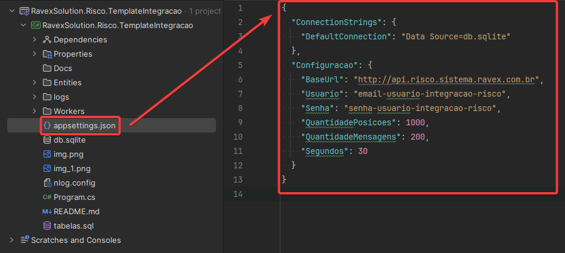
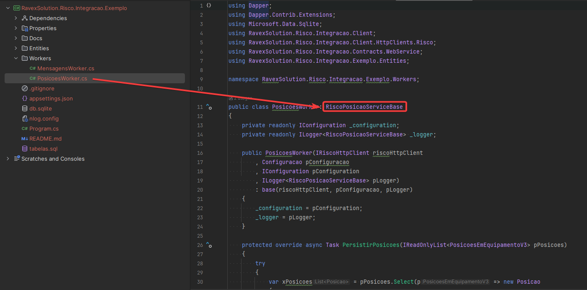
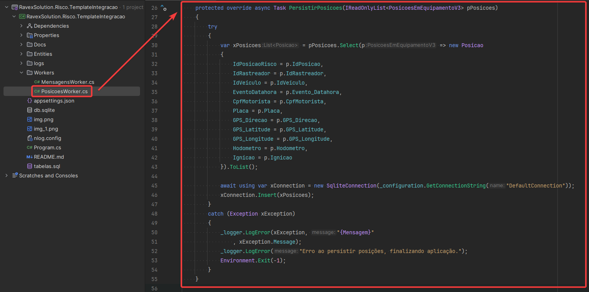
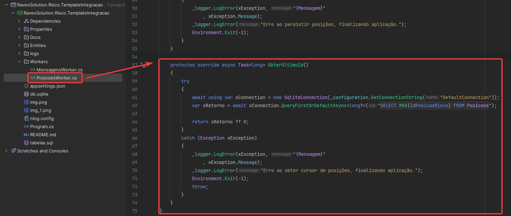

# Exemplo de integração do Sistema de Gerenciamento de Risco
## Introdução
Este projeto tem o intuíto de ser usado como base para o desenvolvimento de integrações com o Sistema de Gerenciamento de Risco da Ravex.

## Tecnologias e bibliotecas usadas neste template:
- C#
- .Net Core 6.0
- Dapper (Usado para conexão com o banco de dados)
- Banco SQLite (Usado para exemplificar a conexão com o banco de dados)

## Como usar

1. Modifique o arquivo `appsettings.json`, com as suas credenciais e configurações:

- `DefaultConnection`: String de conexão com o banco de dados, neste exemplo está sendo usado um banco SQLite, mas pode ser usado qualquer outro banco de dados.
- `BaseUrl`: URL base da API do Sistema de Gerenciamento de Risco.
- `Usuario`: Usuário de acesso ao Sistema de Gerenciamento de Risco. Substitua pelo usuário fornecido pela Ravex.
- `Senha`: Senha de acesso ao Sistema de Gerenciamento de Risco. Substitua pela senha fornecida pela Ravex.
- `QuantidadePosicoes`: Quantidade de posições que serão obtidas a cada requição.
- `QuantidadeMensagem`: Quantidade de mensagens que serão obtidas a cada requisição.
- `Segundos`: A quantidade de segundos que o programa irá esperar para fazer uma nova requisição.

2. Compile e execute o programa.
3. Observe o banco de dados, e veja que as posições e mensagens estão sendo persistidas.

## Funcionamento

Observe o aquivo 'Workers/PosicoesWorker.cs'

- Nele, existe uma classe `PosicoesWorker`, que herda de `RiscoPosicaoServiceBase`
- `RiscoPosicaoServiceBase`, vem de uma biblioteca que a Ravex disponibilizou no Nuget, e contém toda a lógica de conexão com o Sistema de Gerenciamento de Risco.
- Link da biblioteca: https://www.nuget.org/packages/RavexSolution.Risco.Integracao.Client/
- `RiscoPosicaoServiceBase` força a implementação de dois metodos: `PersistirPosicoes` e `ObterUltimoId`.
### Método PersistirPosicoes

- Este método é executado a cada 'x' segundos, onde 'x' é a quantidade de segundos configurada no arquivo 'appsettings.json'.
- O parâmetro pPosicoes, possui todas as posições que foram obtidas na requisição.
- No exemplo abaixo, foram utilizadas as bibliotecas Dapper e SQLite para persistir as posições no banco de dados.
- Caso queira persistir as posições em outro banco de dados, basta substituir o mostrado pelo código de persistência do seu banco de dados.

### Método ObterUltimoId

- Este método é executado antes de fazer uma requisição para a API do Sistema de Gerenciamento de risco
- O seu retorno, deve ser o último ID que foi persistido no banco de dados.
- Assim, ao fazer a requisição, o sistema irá obter apenas as posições que ainda não foram persistidas no banco de dados.
- No exemplo abaixo, foram utilizadas as bibliotecas Dapper e SQLite para obter o último ID persistido no banco de dados.
- Caso queira obter o último ID em outro banco de dados, basta substituir o mostrado pelo código de persistência do seu banco de dados.

## Observações:

- Também diponibilizamos um exemplo de integração de mensagens, que está no arquivo `Workers/MensagensWorker.cs`